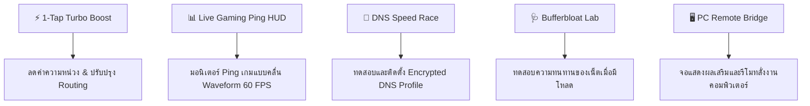

# 🚀 WLAN Optimizer Pro for iOS (iPhone & iPad)

แอปพลิเคชันเร่งความเร็วเน็ต ลดค่าความหน่วง (Ping / Jitter) และเป็น Gaming Companion HUD สำหรับ iPhone และ iPad พัฒนาด้วย **SwiftUI Native (iOS 16.0+)**

---

## 🌟 ฟังก์ชันเด่นที่ใช้งานได้จริงบน iOS



### 1. ⚡ 1-Tap Turbo Boost
- **Gaming Ultra Mode:** เชื่อมต่อ DoH Cloudflare 1.1.1.1 เพื่อการตอบสนองที่ไวที่สุด
- **Ad-Block Fast Mode:** กรอง Tracking และโฆษณาขยะเบื้องหลัง ประหยัดแบนด์วิดท์
- **Stream Stability Mode:** Anycast Cache สำหรับการดูวิดีโอ 4K และสตรีมมิ่งลื่นไหล

### 2. 📊 Live Gaming Ping HUD (Swift Charts)
- กราฟคลื่นความหน่วง Waveform แบบเรียลไทม์ (600-800ms intervals)
- รองรับเซิร์ฟเวอร์เกมยอดนิยม: **RoV TH, PUBG Mobile SEA, Free Fire, Valorant Singapore, Genshin Impact Asia, Roblox**
- คำนวณ **Jitter (RFC 3550)**, **Packet Loss %**, และ **Stability Index (0-100%)**

### 3. 🧪 DNS Speed Race & 1-Tap Profile Installer
- แข่งขันความเร็ว DNS 6 ค่ายดังแบบ Parallel: Cloudflare, Google Public DNS, AdGuard, Quad9, NextDNS, Cisco OpenDNS
- **1-Tap Apple Configuration Profile (.mobileconfig):** ติดตั้ง Encrypted DNS (DoH) เข้าสู่ระบบ iOS Settings ได้ทันทีโดยไม่ต้องเสียค่าบริการใบรับรอง Apple Developer

### 4. 🩺 Bufferbloat Stress Test Lab
- ทดสอบ Latency 3 ขั้นตอน: Idle Ping ➔ Download Load Ping ➔ Upload Load Ping
- ตัดเกรด **A+ ถึง F** พร้อมคำแนะนำการปรับแต่งเราเตอร์ Wi-Fi

### 5. 🖥️ PC Companion & Second-Screen HUD
- วาง iPhone ไว้ข้างจอคอมเพื่อดูค่า Ping ของ PC แบบเรียลไทม์ขณะเล่นเกม
- สั่งเปิด/ปิด **Streaming Mode** และ **Disable Background Scan** บน PC ผ่าน Wi-Fi

---

## 📁 โครงสร้างโปรเจกต์ (Project Structure)

```
d:\WLAN Optimizer\ios\
└── WlanOptimizerIOS\
    ├── WlanOptimizerIOS.xcodeproj\
    │   └── project.pbxproj               // ไฟล์โปรเจกต์ Xcode ดับเบิลคลิกเปิดได้ทันที
    └── WlanOptimizerIOS\
        ├── App\
        │   ├── WlanOptimizerIOSApp.swift // App Entry Point
        │   └── Info.plist                // Network Permissions & Discovery
        ├── Models\
        │   ├── DNSProvider.swift         // ข้อมูล DNS Providers
        │   ├── PingTarget.swift          // รายชื่อเซิร์ฟเวอร์เกม
        │   ├── BufferbloatResult.swift   // โมเดลผลการทดสอบ Bufferbloat
        │   └── NetworkStats.swift        // อัลกอริทึมคำนวณ Jitter & Loss
        ├── Services\
        │   ├── DNSOptimizerService.swift // DoH Benchmark & .mobileconfig Generator
        │   ├── PingMonitorService.swift  // TCP Handshake Socket Latency Engine
        │   ├── BufferbloatService.swift  // Multi-stream Network Stress Tester
        │   ├── NetworkDoctorService.swift// ตรวจสอบสถานะ Wi-Fi และข้อแนะนำ
        │   └── PCBridgeService.swift     // รับส่งข้อมูลกับโปรแกรมบนคอมพิวเตอร์
        ├── ViewModels\
        │   ├── TurboBoostViewModel.swift
        │   ├── PingHUDViewModel.swift
        │   ├── DNSBenchmarkViewModel.swift
        │   ├── BufferbloatViewModel.swift
        │   └── PCBridgeViewModel.swift
        ├── Views\
        │   ├── MainTabView.swift         // แถบเมนูด้านล่าง Cyberpunk Dark Theme
        │   ├── TurboBoostView.swift      // หน้าจอหลักปุ่ม Turbo Reactor
        │   ├── LivePingHUDView.swift     // หน้าจอกราฟ Swift Charts
        │   ├── DNSOptimizerView.swift    // หน้าจอ Benchmark DNS
        │   ├── BufferbloatView.swift     // หน้าจอทดสอบ Bufferbloat
        │   ├── PCBridgeView.swift        // หน้าจอ Remote ควบคุม PC
        │   ├── NetworkDoctorView.swift   // หน้าตรวจสุขภาพเน็ต iOS
        │   └── Components\
        │       ├── GlassCard.swift       // Frosted Glass UI Card
        │       └── GaugeRingView.swift   // วงแหวนแสดงค่ามาตรวัด
        └── Resources\
            └── Assets.xcassets           // ไอคอนและชุดสี Cyberpunk
```

---

## 🛠️ วิธีการเปิดและทดสอบโปรเจกต์บนเครื่อง Mac / iPhone

### วิธีที่ 1: เปิดด้วย Xcode (บน macOS)
1. คัดลอกโฟลเดอร์ `WlanOptimizerIOS` ไปยังเครื่อง Mac
2. ดับเบิลคลิกที่ไฟล์ **`WlanOptimizerIOS.xcodeproj`** เพื่อเปิดใน Xcode
3. เลือก Simulator (เช่น iPhone 15 Pro / 16 Pro) หรือต่อสาย iPhone เข้ากับ Mac
4. กดปุ่ม **Run (Cmd + R)** เพื่อคอมไพล์และทดสอบแอปได้ทันที

### วิธีที่ 2: ติดตั้งลง iPhone โดยตรง (Sideloading)
- สามารถใช้เครื่องมือ เช่น **Sideloadly**, **AltStore**, หรือ **TrollStore** ในการ Build IPA เพื่อติดตั้งลงบนเครื่อง iPhone ส่วนตัวได้

---

## 📲 วิธีติดตั้ง Fast DNS Profile บน iPhone (ไม่ต้องใช้ Mac)
1. เปิดแอปในแท็บ **Fast DNS** หรือกดปุ่ม **BOOST NOW**
2. เลือก DNS ที่ต้องการ (เช่น *Cloudflare 1.1.1.1* หรือ *AdGuard*)
3. แตะ **Install Profile** ➔ แตะ **อนุญาต (Allow)** บน Safari
4. เปิดแอป **Settings (การตั้งค่า)** ของ iPhone
5. จะมีเมนูขึ้นด้านบนว่า **Profile Downloaded (ดาวน์โหลดโปรไฟล์แล้ว)**
6. แตะเข้าไปแล้วกด **Install (ติดตั้ง)** ที่มุมขวาบน ➔ ป้อนรหัสผ่านปลดล็อคเครื่อง
7. เน็ตของเครื่อง iPhone จะเปลี่ยนมาใช้ระบบ Encrypted DoH ความเร็วสูงทันที ⚡
